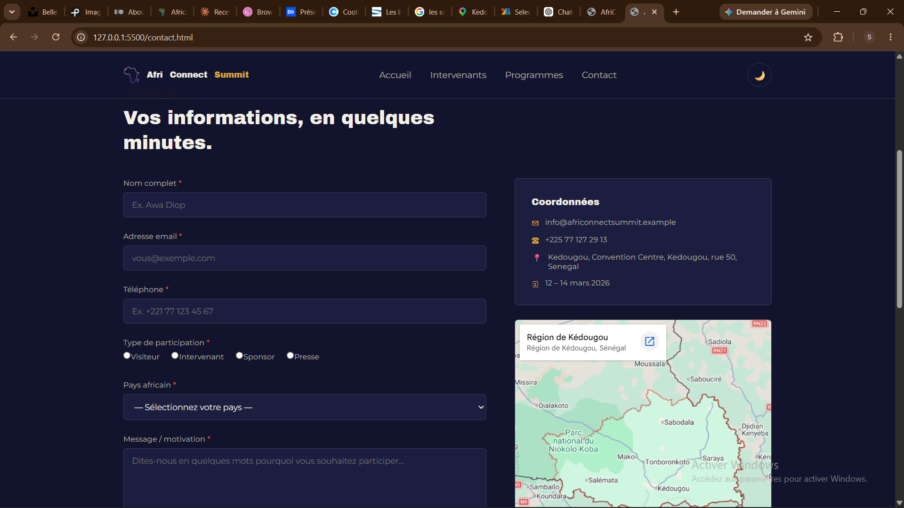
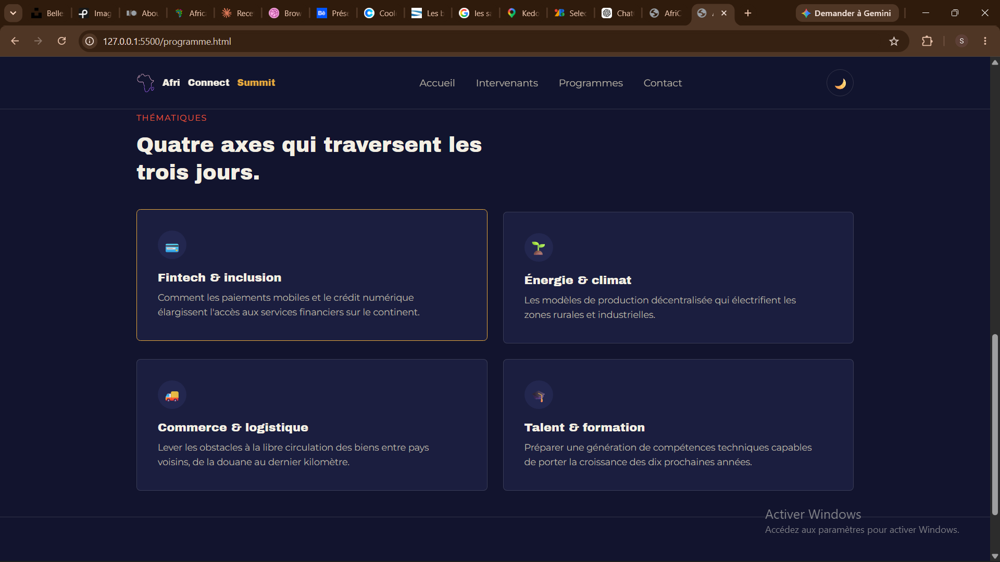
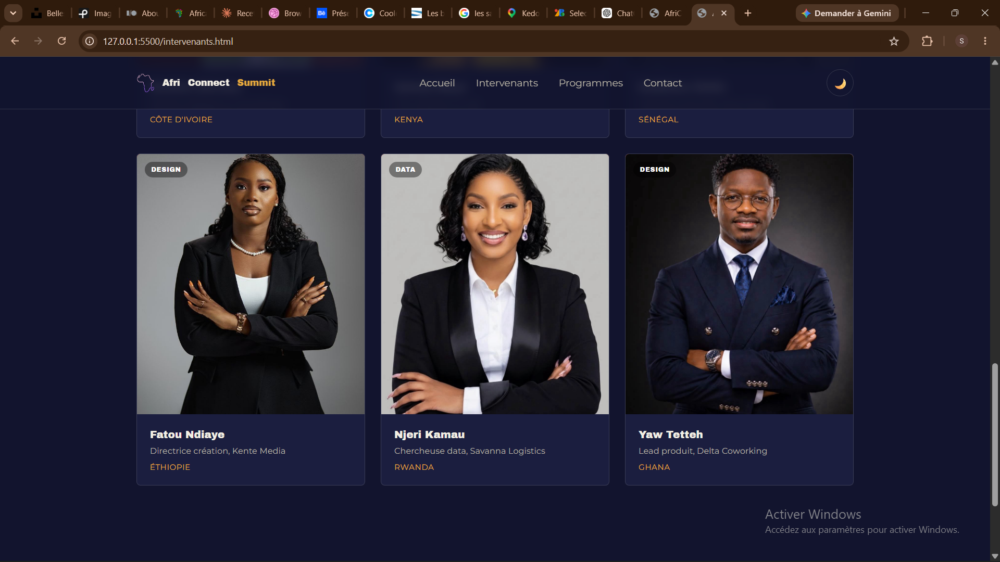
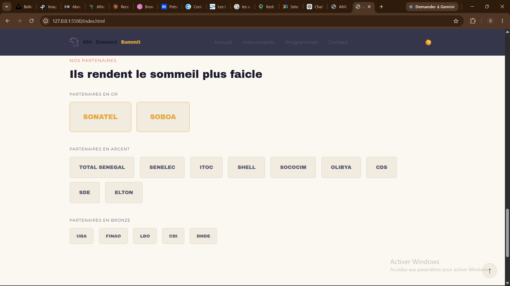

# AfriConnect Summit 🌍
 
C'est le site web d'un événement fictif appelé **AfriConnect Summit**, un sommet de 3 jours (12 au 14 mars 2026) qui réunit des entrepreneurs, des investisseurs et des décideurs de plusieurs pays africains.
 
Le site est fait en **HTML, CSS et JavaScript simple** (pas de framework comme React, pas d'installation nécessaire). C'est un bon projet pour apprendre les bases du web.
Auteur Seydou Abou Sene 
Promotion L1 IAGE - ISI 2025/2026
Lien du site  https://seydouabousene.github.io/-SENE-Abou-AfriConnectSummit/
Voila quelque capture    
 
## 📁 Ce qu'il y a dans le dossier
 
- **index.html** → la page d'accueil (grand titre, chiffres clés, pourquoi participer, intervenants, sponsors)
- **programme.html** → le planning du sommet, avec des onglets Jour 1 / Jour 2 / Jour 3
- **intervenants.html** → la liste de tous les intervenants, avec des boutons pour filtrer par thème
- **contact.html** → le formulaire d'inscription, la FAQ et une carte
- **css/style.css** → tout le style du site (couleurs, mode sombre/clair, responsive)
- **js/main.js** → tout ce qui bouge sur le site (menu, compte à rebours, formulaire, etc.)
- **images/** → les photos et logos
## ✨ Ce que le site sait faire
 
- Changer entre mode sombre et mode clair avec un bouton
- Un compte à rebours qui avance tout seul jusqu'au jour du sommet
- Des chiffres qui montent petit à petit quand on arrive sur la section (animation)
- Des éléments qui apparaissent en douceur quand on scrolle
- Un menu qui se transforme en menu "hamburger" sur mobile
- Un bouton pour remonter en haut de la page
- Un programme avec des onglets à cliquer (Jour 1, Jour 2, Jour 3)
- Un système pour filtrer les intervenants par catégorie (Tous, IA & Tech, Business, Design, Data)
- Un formulaire d'inscription qui vérifie ce que l'utilisateur écrit (nom, email, téléphone, etc.) et affiche des messages d'erreur ou de succès
- Une FAQ qui s'ouvre et se ferme au clic, sans JavaScript
## 🎨 Les couleurs et polices
 
Les couleurs sont définies une seule fois en haut du fichier `style.css`, dans une partie appelée `:root`. Ça permet de les réutiliser partout et de changer facilement tout le site d'un coup.
 
Il y a un fond bleu nuit foncé par défaut, avec deux couleurs qui ressortent : un doré et un orange corail. Le mode clair change juste ces mêmes couleurs pour un fond clair.
 
Les polices utilisées viennent de Google Fonts : Archivo Black pour les titres, Montserrat pour le reste du texte. Les icônes viennent de Font Awesome.
 
## 🚀 Comment lancer le site
 
Pas besoin d'installer quoi que ce soit, c'est un site simple :
 
1. Télécharger ou copier le dossier du projet
2. Ouvrir le fichier `index.html` directement dans un navigateur (double-clic dessus)
Si certaines choses ne s'affichent pas bien, tu peux aussi lancer un petit serveur local, par exemple avec la commande `python3 -m http.server` dans le dossier du projet, puis ouvrir l'adresse indiquée dans le navigateur.
## 🌐 Les 4 pages du site
 
**index.html** — la page d'accueil avec la présentation du sommet, les chiffres clés, les raisons de participer, les intervenants vedettes et les sponsors.
 
**programme.html** — le planning détaillé des 3 jours, et les 4 grands thèmes du sommet.
 
**intervenants.html** — tous les intervenants, avec des filtres pour trier par domaine.
 
**contact.html** — le formulaire pour s'inscrire, les infos de contact, une carte et une FAQ.
 
## 📄 Licence
 
© 2026 AfriConnect Summit. Tous droits réservés.